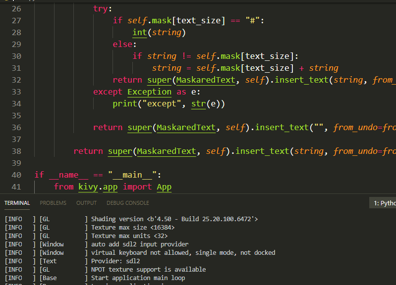

# kivy-maskared-text
Repositório para funções com textos.

## Requisitos
```
python >= 3.7

kivy >= 1.11.1
```

## Como executar
```
python3 main.py

or

py main.py
```

## Entradas
* use_symbol:
  * Usado para permitir o filtro pelos símbolos ou não.
  * Tipo: bool
  * Exemplo de Entrada:
  
    ```use_symbol = True```

  * Neste exemplo irá ser efetuado a validação dos símbolos.

* symbol:
  * Usado para definir os símbolos de entrada do texto.
  * Tipo: string
  * Examplo de Entrada:

    ```symbol = "123abc."```
    
  * Neste exemplo só permite a entrada dos caracteres definidos.

* use_mask:
  * Usado para permitir o filtro pela máscara ou não.
  * Tipo: bool
  * Exemplo de Entrada:
  
    ```use_mask = True```

  * Neste exemplo irá ser permitido a validação de cada entrada da máscara.

* mask:
  * Usado para definir a máscara de entrada do texto.
  * Tipo: string
  * Examplo de Entrada:

    ```symbol = "##/##/####"```
  
  * Neste exemplo só permite a entrada dos caracteres definidos como um texto formatado.

## Exemplo

<p align="center">
  <a href="https://github.com/KivyBrazil/kivy-gif">
    
  </a>
</p>
